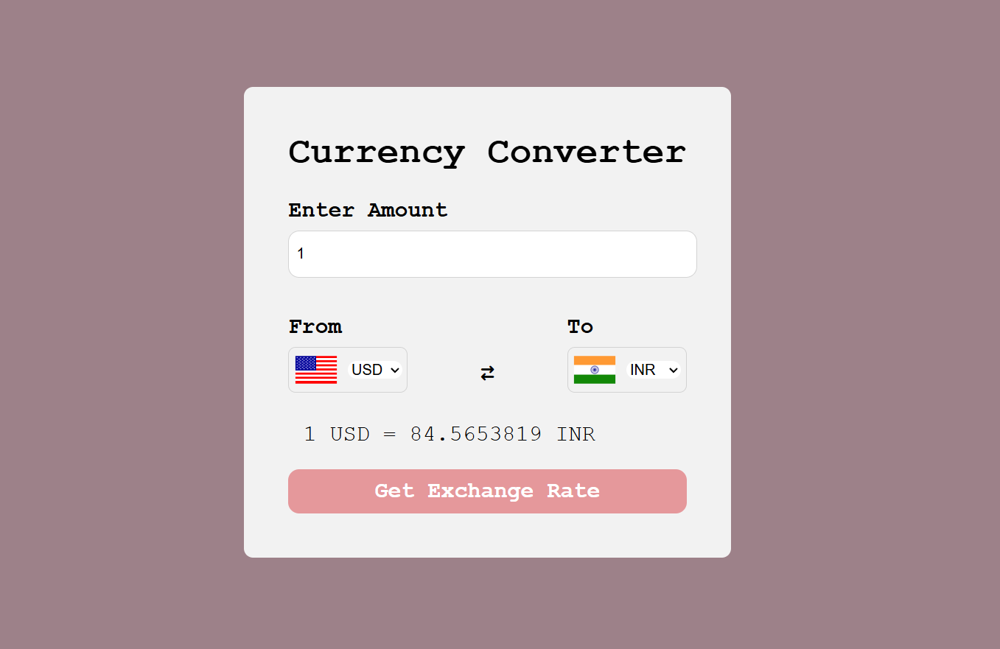
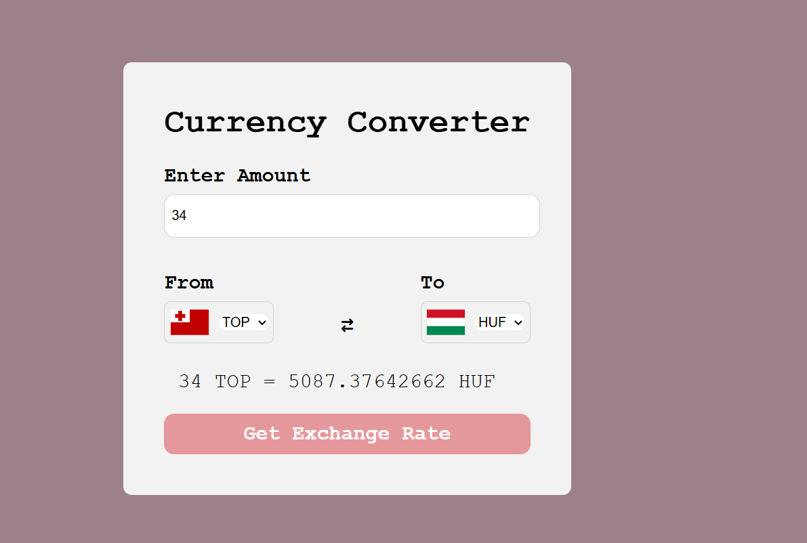

# Currency Converter

A simple web-based currency converter application that allows users to convert amounts between different currencies using pre-fetched exchange rates.

## Features

- **Pre-Fetched Exchange Rates**: Converts currencies using exchange rates fetched from an external API.
- **Dynamic Dropdowns**: Automatically populates currency dropdowns with country codes.
- **Flag Display**: Displays country flags for selected currencies.
- **Responsive Design**: Styled for a clean and user-friendly interface.

## Technologies Used

- **HTML**: For structuring the web page.
- **CSS**: For styling the application.
- **JavaScript**: For dynamic functionality and API integration.

## How to Use

1. Open the application in your browser by launching `index.html`.
2. Enter the amount you want to convert in the input field.
3. Select the "From" and "To" currencies using the dropdowns.
4. Click the "Get Exchange Rate" button to see the converted amount and exchange rate.

## Project Structure

- `index.html`: The main HTML file for the application.
- `style.css`: Contains the styles for the application.
- `app.js`: Handles the dynamic functionality, including API calls and DOM manipulation.
- `code.js`: Contains the list of country codes and helper functions.

## API Integration

This project uses the [Currency API](https://github.com/fawazahmed0/currency-api) to fetch exchange rates. The base URL for the API is:

## Product Preview

Here are some screenshots of the Currency Converter application:

### Home Page

### Conversion Example

